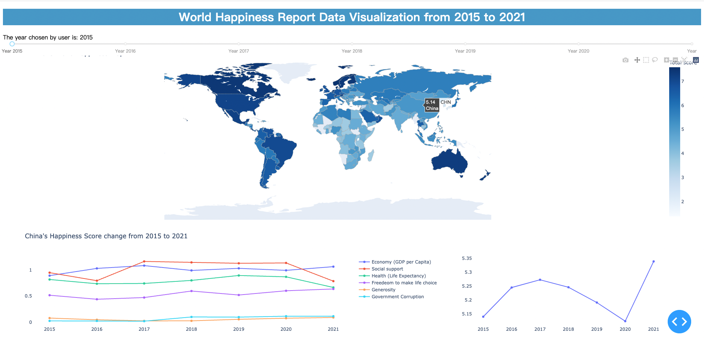
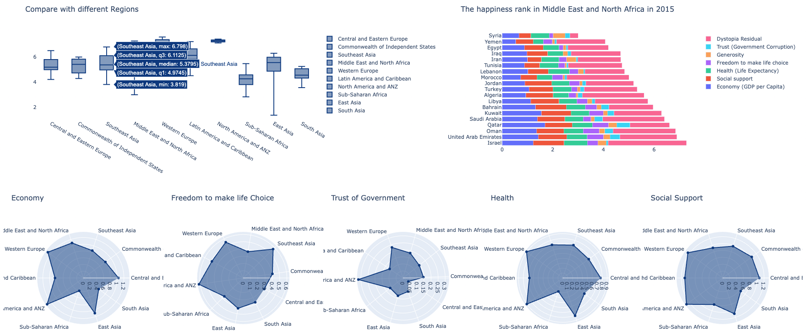
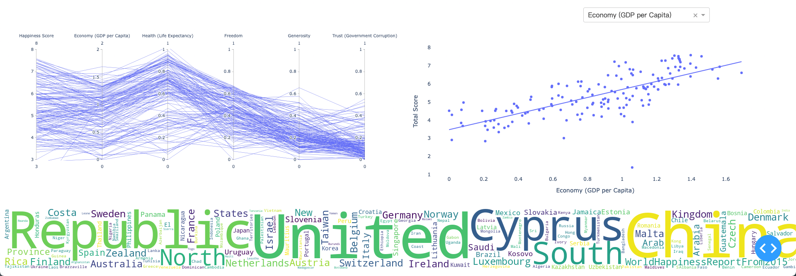

# WorldHappinessDataVis
For Chinese version below :cn:  
This is the Data Visualization final project:smile:  If you find it useful please star it thank you.  All datasets come from Kaggle.  
author: Cheng Huang, Saiyang Zhang.   

## Set up
```
pip install numpy
pip install pandas
pip install plotly_express==0.4.0 (maybe I forget it)
pip install dash
pip install plotly==5.3.1
```
if you are interested in how to generate WorldCloud, it may helpful to install 
```
pip install wordcloud
```
## Runtime Screenshot



