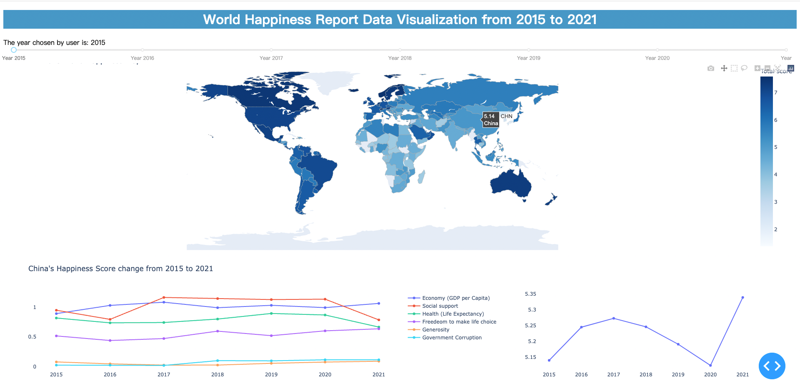
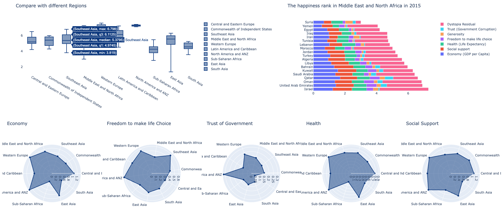
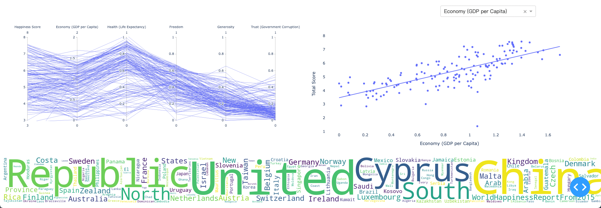

# WorldHappinessDataVis
For Chinese version below :cn:  
This is the Data Visualization final project:smile:  If you find it useful please star it thank you.  All datasets come from Kaggle.  
author: Cheng Huang, Saiyang Zhang.   

## What are we doing ?
- We want to make it more vividly for user to use.
- We want to make compare with different countries such as the score and the rank.
- We want to see the trend change about one specific country.
- We want to find which area's people are much happier.
- We want to know the relationship between happiness and different factors (like health, freedom to make life choice or ...)
- We want to know the relationship between happiness and developed country developing country and least developed country.


## Set up
```
pip install numpy
pip install pandas
pip install plotly_express==0.4.0 (maybe I forget it)
pip install dash
pip install plotly==5.3.1
```
if you are interested in how to generate WorldCloud, it may helpful to install 
```
pip install wordcloud
```
As we have already include a dockerfile so you can use docker to run using below command if you want :thinking:	
```
docker build -t datavis .
docker run -p 8080:8080 datavis
```
or 
```
python3 run main.py
```

## Runtime Screenshot





# 世界人民幸福指数可视化项目
本项目为数据可视化课程最终项目作业。如果你发现有趣那就star一下吧～。所有数据集均来自Kaggle。  
作者：黄程，张赛阳


## 我们想做什么？
- 我们想更加生动形象的将数据展示给用户
- 我们想将不同国家之间做对比，例如排名对比、得分对比。
- 我们想要某一个国家近些年来（2015-2021）的幸福指数变化情况。
- 我们想要分析出那个地区的人民更加幸福。
- 我们想要得出幸福指数和不同因素之间的关系例如与健康的关系。
- 我们想要得出幸福指数和国家属性的关系（发达国家、发展中国家、欠发达国家）。

## 准备工作
```
pip install numpy
pip install pandas
pip install plotly_express==0.4.0 (maybe I forget it)
pip install dash
pip install plotly==5.3.1
```
如果你想知道如何生成文字云请安装如下包
```
pip install wordcloud
```
本项目已配置dockerfile，如果你想通过docker运行请执行一下指令。:thinking:	
```
docker build -t datavis .
docker run -p 8080:8080 datavis
```
或者直接运行
```
python3 run main.py
```
## 运行时截图
同上
